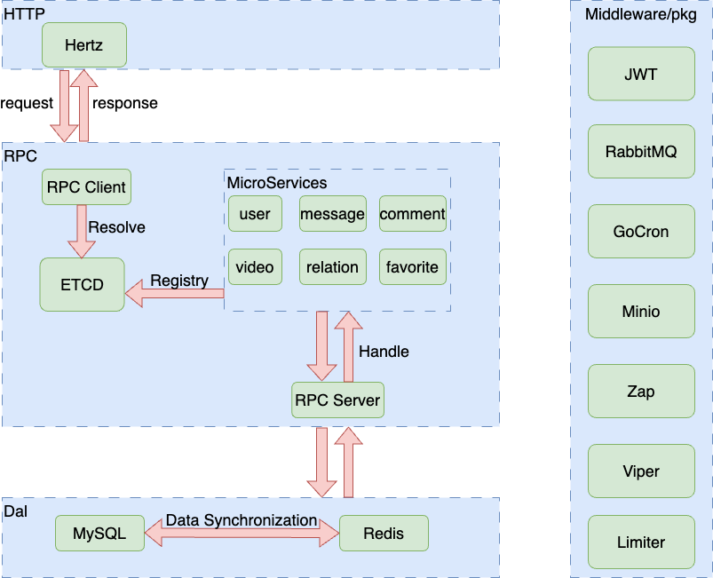

# 一、项目介绍

**基于 “Hertz/Gin HTTP框架 + Kitex 微服务框架” 完成的第五届字节跳动青训营—极简版抖音项目**

# 二、项目实现

## 2.1 技术选型与相关开发文档

本项目包含三大类接口：基础接口、互动接口、社交接口。采用微服务架构以及 Docker 部署的方式。项目的数据库以及中间件均由 Docker 运行。

[ApiFox开发文档](https://www.apifox.cn/apidoc/shared-7b33652d-6080-41bb-a70e-7a165d55daae/api-63185966)

## 2.2 架构设计

### 2.2.1 架构方案

分为 HTTP、RPC 和 DAL 三层：

- HTTP 层使用 Hertz 框架处理HTTP 请求；
- RPC 层使用 Kitex 框架，使用 ETCD 做服务注册与发现；
- DAL 层即数据访问层，包含 Redis 和 MySQL

## 2.3 项目代码介绍

###  使用的框架和作用

- Hertz：提供 HTTP 服务；Kitex：提供 RPC 服务；ETCD：服务注册与发现；
- JWT：token 的生成与校验；
- Minio：图片和视频的对象存储；
- Gorm：对 MySQL 进行 ORM 操作，Go-Redis：操作 Redis 对频繁访问的数据进行缓存，使用 Gorm 的 db-resolver 插件进行读写分离操作；
- Redis：对点赞/取消赞和关注/取关操作进行缓存，按照一定策略使键过期，并定时同步数据到数据库；
- RabbitMQ：对 Redis 的异步操作、流量削峰；
- Gocron：定时任务，同步 Redis 与 MySQL 之间的数据；
- Viper：读取配置文件；
- Zap：日志打印；Lumberjack：日志分割；
- Nginx：反向代理与负载均衡。

## 3 启动/停止服务

- 启动服务：`sh startup.sh`
- 停止运行：`sh shutdown.sh`
